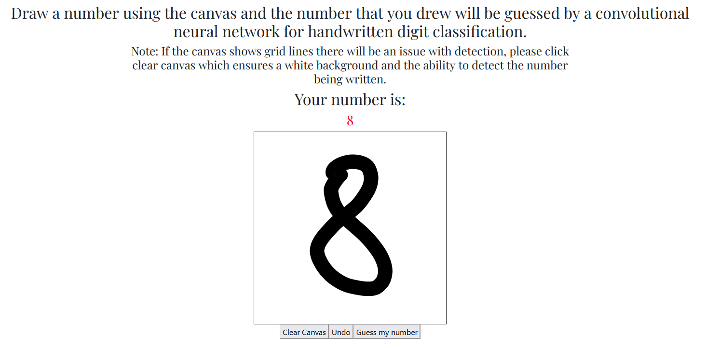

# handwritten-classification

Application utilizing a Convolutional Neural Network (CNN) for handwritten digit classification. Currently has a test accuracy of 98.6%.
Images of numbers can either be analyzed locally from a hand drawn image or if a data uri is provided through a text file (Provide the path of the local text file). The below example uses a paint like canvas which can also be analyzed.

# Working live example with a canvas
Site: http://ec2-3-128-207-4.us-east-2.compute.amazonaws.com/canvas

